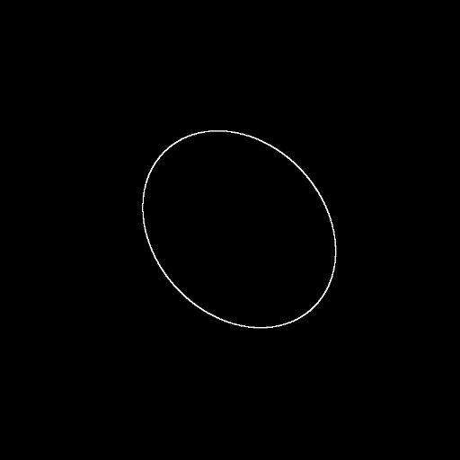
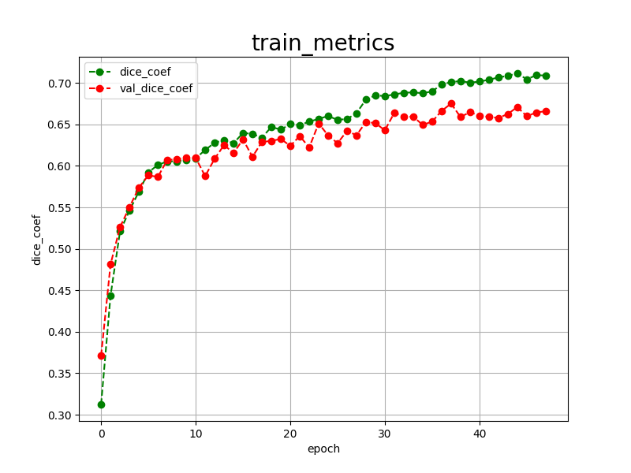

<h2>Tensorflow-Image-Segmentation-Augmented-Fetal-Head (2024/12/07)</h2>

This is the first experiment of Image Segmentation for Fetal-Head 
 based on 
the latest <a href="https://github.com/sarah-antillia/Tensorflow-Image-Segmentation-API">Tensorflow-Image-Segmentation-API</a>, 
and  <a href="https://drive.google.com/file/d/1AyIajlgCUJTKVRsNzN-XZRNyCpLP4vKK/view?usp=sharing">
Fetal-Head-ImageMask-Dataset.zip</a>, which was derived by us from 
<a href="https://zenodo.org/records/1327317/files/training_set.zip?download=1">training_set.zip</a> in
the website <a href="https://zenodo.org/records/1327317">
<b>Automated measurement of fetal head circumference using 2D ultrasound images</b></a>
 

 
 
<b>Data Augmentation Strategy:</b> 
 To address the limited size of Fetal-Head, 
 we employed <a href="./src/ImageMaskAugmentor.py">an online augmentation tool</a> to augment Fetal-Head dataset, which supports the following augmentation methods.
<li>Vertical flip</li>
<li>Horizontal flip</li>
<li>Rotation</li>
<li>Shrinks</li>
<li>Shears</li> 
<li>Deformation</li>
<li>Distortion</li>
<li>Barrel distortion</li>
<li>Pincushion distortion</li>
 
Please see also the following tools  
<li><a href="https://github.com/sarah-antillia/Image-Deformation-Tool">Image-Deformation-Tool</a></li>
<li><a href="https://github.com/sarah-antillia/Image-Distortion-Tool">Image-Distortion-Tool</a></li>
<li><a href="https://github.com/sarah-antillia/Barrel-Image-Distortion-Tool">Barrel-Image-Distortion-Tool</a></li>

 

<b>Actual Image Segmentation for Images of 512x512 pixels</b> 
As shown below, the inferred masks look similar to the ground truth masks.  

<table>
<tr>
<th>Input: image</th>
<th>Mask (ground_truth)</th>
<th>Prediction: inferred_mask</th>
</tr>
<tr>
<td></td>
<td></td>
<td></td>
</tr>

<tr>
<td></td>
<td></td>
<td></td>
</tr>

<tr>
<td></td>
<td></td>
<td></td>
</tr>
</table>

 
In this experiment, we used the simple UNet Model 
<a href="./src/TensorflowUNet.py">TensorflowSlightlyFlexibleUNet</a> for this Fetal-HeadSegmentation Model. 
As shown in <a href="https://github.com/sarah-antillia/Tensorflow-Image-Segmentation-API">Tensorflow-Image-Segmentation-API</a>.
you may try other Tensorflow UNet Models: 

<li><a href="./src/TensorflowSwinUNet.py">TensorflowSwinUNet.py</a></li>
<li><a href="./src/TensorflowMultiResUNet.py">TensorflowMultiResUNet.py</a></li>
<li><a href="./src/TensorflowAttentionUNet.py">TensorflowAttentionUNet.py</a></li>
<li><a href="./src/TensorflowEfficientUNet.py">TensorflowEfficientUNet.py</a></li>
<li><a href="./src/TensorflowUNet3Plus.py">TensorflowUNet3Plus.py</a></li>
<li><a href="./src/TensorflowDeepLabV3Plus.py">TensorflowDeepLabV3Plus.py</a></li>

 

<h3>1. Dataset Citation</h3>
The dataset used here has been derived from 
<a href="https://zenodo.org/records/1327317/files/training_set.zip?download=1">training_set.zip</a> in
the website <a href="https://zenodo.org/records/1327317">
<b>Automated measurement of fetal head circumference using 2D ultrasound images</b></a>
  
<b>Creators:</b> 
Thomas L. A. van den Heuvel, Dagmar de Bruijn, Chris L. de Korte, Bram van Ginneken 

 
For more information about this dataset go to: <a href="https://hc18.grand-challenge.org/">
https://hc18.grand-challenge.org/</a>
 
 
<h3>
<a id="2">
2 Fetal-Head ImageMask Dataset
</a>
</h3>
 If you would like to train this Fetal-Head Segmentation model by yourself,
 please download the dataset from the google drive  
<a href="https://drive.google.com/file/d/1AyIajlgCUJTKVRsNzN-XZRNyCpLP4vKK/view?usp=sharing">
Fetal-Head-ImageMask-Dataset.zip</a>
, expand the downloaded ImageMaskDataset and put it under <b>./dataset</b> folder to be
<pre>
./dataset
└─Fetal-Head
    ├─test
    │   ├─images
    │   └─masks
    ├─train
    │   ├─images
    │   └─masks
    └─valid
        ├─images
        └─masks
</pre>
 
On the derivation of this dataset, please refer to the following Python scripts: 
<li><a href="./generator/ImageMaskDatasetGenerator.py">ImageMaskDatasetGenerator.py</a></li>
<li><a href="./generator/split_master.py">split_master.py.</a></li>
 
 
<b>Fetal-Head Statistics</b> 
 
 
As shown above, the number of images of train and valid datasets is not enough to use for a training set of our segmentation model.
Therefore, we enabled our online augmentation tool in the training process.

 
 
<b>Train_images_sample</b> 

 
<b>Train_masks_sample</b> 

 

<h3>
3 Train TensorflowUNet Model
</h3>
 We have trained Fetal-HeadTensorflowUNet Model by using the following
<a href="./projects/TensorflowSlightlyFlexibleUNet/Fetal-Head/train_eval_infer.config"> <b>train_eval_infer.config</b></a> file.  
Please move to ./projects/TensorflowSlightlyFlexibleUNet/Fetal-Headand run the following bat file. 
<pre>
>1.train.bat
</pre>
, which simply runs the following command. 
<pre>
>python ../../../src/TensorflowUNetTrainer.py ./train_eval_infer.config
</pre>

<b>Model parameters</b> 
Defined a small <b>base_filters</b> and large <b>base_kernels</b> for the first Conv Layer of Encoder Block of 
<a href="./src/TensorflowUNet.py">TensorflowUNet.py</a> 
and a large num_layers (including a bridge between Encoder and Decoder Blocks).
<pre>
[model]
base_filters   = 16
base_kernels   = (9,9)
num_layers     = 8
dilation       = (3,3)
</pre>

<b>Learning rate</b> 
Defined a small learning rate.  
<pre>
[model]
learning_rate  = 0.0001
</pre>

<b>Online augmentation</b> 
Enabled our online augmentation tool. 
<pre>
[model]
model         = "TensorflowUNet"
generator     = True
</pre>

<b>Loss and metrics functions</b> 
Specified "bce_dice_loss" and "dice_coef". 
<pre>
[model]
loss           = "bce_dice_loss"
metrics        = ["dice_coef"]
</pre>
<b >Learning rate reducer callback</b> 
Enabled learing_rate_reducer callback, and a small reducer_patience.
<pre> 
[train]
learning_rate_reducer = True
reducer_factor     = 0.4
reducer_patience   = 4
</pre>

<b>Early stopping callback</b> 
Enabled early stopping callback with patience parameter.
<pre>
[train]
patience      = 10
</pre>

<b>Epoch change inference callbacks</b> 
Enabled epoch_change_infer callback. 
<pre>
[train]
epoch_change_infer       = True
epoch_change_infer_dir   =  "./epoch_change_infer"
epoch_changeinfer        = False
epoch_changeinfer_dir    = "./epoch_changeinfer"
num_infer_images         = 6
</pre>

By using this callback, on every epoch_change, the inference procedure can be called
 for 6 images in <b>mini_test</b> folder. This will help you confirm how the predicted mask changes 
 at each epoch during your training process.    

<b>Epoch_change_inference output</b> 
 
 

In this experiment, the training process was stopped at epoch 48  by EarlyStopping Callback.  
 
 

<a href="./projects/TensorflowSlightlyFlexibleUNet/Fetal-Head/eval/train_metrics.csv">train_metrics.csv</a> 
 

 
<a href="./projects/TensorflowSlightlyFlexibleUNet/Fetal-Head/eval/train_losses.csv">train_losses.csv</a> 
 

 

<h3>
4 Evaluation
</h3>
Please move to a <b>./projects/TensorflowSlightlyFlexibleUNet/Fetal-Head</b> folder, 
and run the following bat file to evaluate TensorflowUNet model for Fetal-Head. 
<pre>
./2.evaluate.bat
</pre>
This bat file simply runs the following command.
<pre>
python ../../../src/TensorflowUNetEvaluator.py ./train_eval_infer_aug.config
</pre>

Evaluation console output: 

  Image-Segmentation-Fetal-Head

<a href="./projects/TensorflowSlightlyFlexibleUNet/Fetal-Head/evaluation.csv">evaluation.csv</a> 

The loss (bce_dice_loss) to this Fetal-Head/test was not low, but dice_coef not so high as shown below.
 
<pre>
loss,0.276
dice_coef,0.5255
</pre>
 

<h3>
5 Inference
</h3>
Please move to a <b>./projects/TensorflowSlightlyFlexibleUNet/Fetal-Head</b> folder 
,and run the following bat file to infer segmentation regions for images by the Trained-TensorflowUNet model for Fetal-Head. 
<pre>
./3.infer.bat
</pre>
This simply runs the following command.
<pre>
python ../../../src/TensorflowUNetInferencer.py ./train_eval_infer_aug.config
</pre>

<b>mini_test_images</b> 
 
<b>mini_test_mask(ground_truth)</b> 
 

<b>Inferred test masks</b> 
 
 

<b>Enlarged images and masks </b> 

<table>
<tr>
<th>Image</th>
<th>Mask (ground_truth)</th>
<th>Inferred-mask</th>
</tr>

<tr>
<td></td>
<td></td>
<td></td>
</tr>

<tr>
<td></td>
<td></td>
<td></td>
</tr>

<tr>
<td></td>
<td></td>
<td></td>
</tr>
<tr>
<td></td>
<td></td>
<td></td>
</tr>
<tr>
<td></td>
<td></td>
<td></td>
</tr>
<tr>
<td></td>
<td></td>
<td></td>
</tr>
</table>

 

<h3>
References
</h3>
<b>1. Automated measurement of fetal head circumference </b> 
<a href="https://hc18.grand-challenge.org/">https://hc18.grand-challenge.org/</a>
 
 

<b>2. Evolutionary Techniques on Fetal Head Segmentation</b> 
Prerna Bhalla, Ramesh Kumar Sunkaria, Anterpreet Kaur Bedi 
<a href="https://books.aijr.org/index.php/press/catalog/view/114/44/1492-1">
Evolutionary Techniques on Fetal Head Segmentation
</a>
 
doi: https://doi.org/10.21467/proceedings.114.18 

 
<b>3. Precise segmentation of fetal head in ultrasound images using improved U-Net model</b> 

Vimala Nagabotu, Anupama Namburu 
<a href="https://onlinelibrary.wiley.com/doi/full/10.4218/etrij.2023-0057">https://onlinelibrary.wiley.com/doi/full/10.4218/etrij.2023-0057</a> 

doi: https://doi.org/10.4218/etrij.2023-0057 

